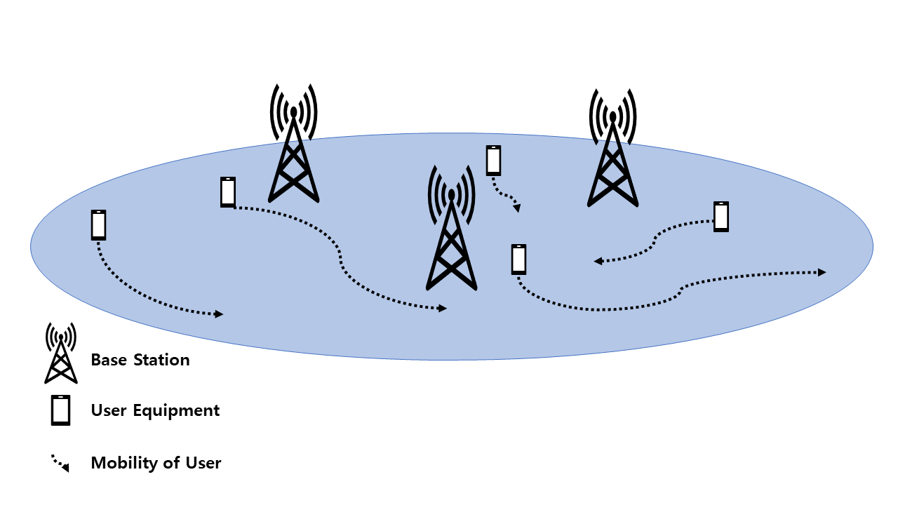
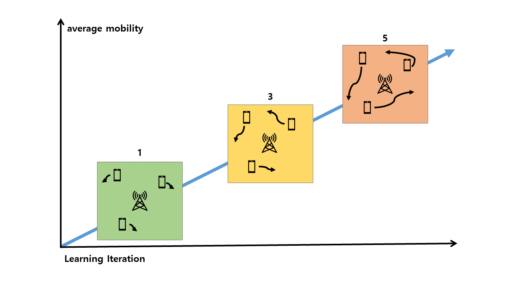

# Reinforcement-Learning-via-Curriculum-in-a-Wireless-Network-with-High-User-Mobility

## Overview
This is the experimental code for 'Resource Allocation and User Association Using Reinforcement Learning Through Curriculum in a Wireless Network with High User Mobility' for ICOIN2023.

## Abstract
With the rapid development of wireless networks and artificial intelligence technologies, various applications in mobile networks have emerged. Especially when the user's mobility is high, such as Internet of Vehicles, Resource allocation is more complex, and handover issues also occur more frequently. In addition, the problem of resource allocation in wireless networks is known as the NP-Hard problem. Using reinforcement learning to solve this problem is a promising solution. However, designing a reward function is very difficult, and an incorrect design of the reward function can lead to entirely unexpected results. In this paper, we propose a curriculum learning technique to solve the above problem so that the reinforcement learning agent can learn more accurately. We made the model learn accurately by sequentially increasing the mobility of each user during learning. The proposed method demonstrates a faster convergence rate and better performance.

## License
MIT
